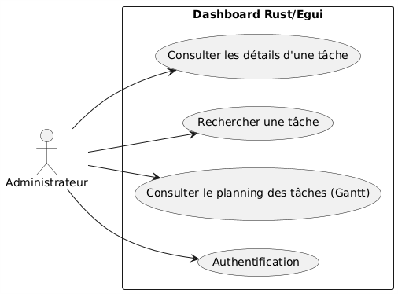

# Diagrammes UML

Ce dossier contient tous les diagrammes UML liés à la modélisation du projet Dashboard Rust/Egui.

## Diagrammes disponibles

### Diagramme de Classes Simplifié
  
Représente la structure statique du système en montrant les classes et les relations entre elles de manière simplifiée. Cela décrit en partie le modèle MVC.

### Diagramme de Cas d'Utilisation
  
Montre les différentes fonctionnalités du système du point de vue de l'utilisateur.

### Diagramme d'États
**TODO**

Décrit les différents états possibles d'un objet et les transitions entre ces états.

### Diagramme d'Activités
**TODO**

Représente le flux de contrôle d'une activité à une autre dans le système.

### Diagramme de Séquence
**TODO**

Illustre les interactions entre les objets du système dans l'ordre chronologique.
