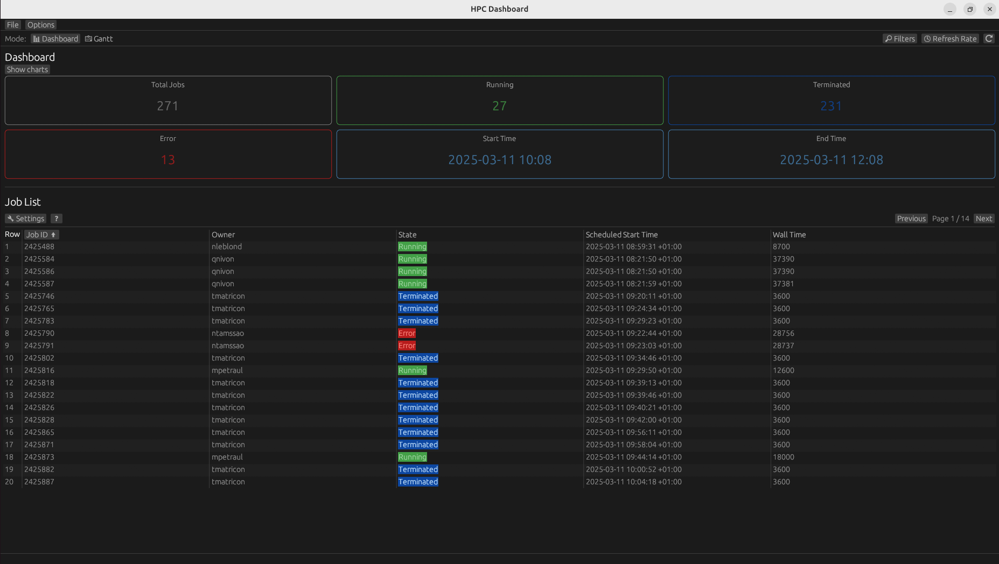
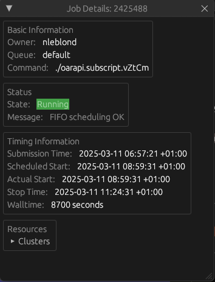
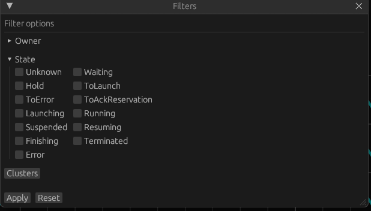
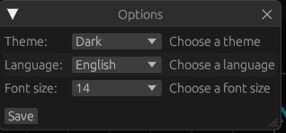

<h1 align="center">Rapport final - Dashboard en Rust pour OAR</h1>
<p align="center">Rémi DEL MEDICO - Romain MIRAS - Alexandre ARLE - Amaury GOGUILLOT</p>

## Table des matières
1. [Rappel du sujet](#rappel)
2. [Technologies employées](#technos)
3. [Architecture technique](#archi)
4. [Réalisation technique](#réalisation)
5. [Gestion de projet](#gestion)
6. [Outils](#outils)
7. [Métriques logicielles](#métriques)
8. [Conclusion](#conclusion)
9. [Annexes](#annexes)

## Rappel du sujet <a id="rappel"></a>

### Contexte
[OAR](https://oar.imag.fr/) est un gestionnaire de tâches et de ressources utilisé dans les environnements HPC (High Performance Computing) pour orchestrer et gérer efficacement les ressources de calcul d'un cluster. Développé par l'équipe [DATAMOVE](https://team.inria.fr/datamove/), équipe de recherche commune entre le laboratoire [INRIA](https://www.inria.fr/fr) et le [LIG](https://www.liglab.fr/fr) (Laboratoire d'Informatique de Grenoble), il est largement utilisé dans le milieu académique et de la recherche. Cependant, malgré ses fonctionnalités avancées, peu d'outils interactifs en temps réel existent pour visualiser et administrer les ressources gérées par OAR.

L'objectif de ce projet est de développer une interface utilisateur moderne, intuitive et performante pour OAR, permettant de visualiser et d'interagir avec les tâches et les ressources d'un cluster. Cette interface doit notamment proposer :

- Un diagramme de Gantt interactif pour visualiser l'occupation des ressources dans le temps
- Une vue détaillée des tâches et de leur état (en attente, en cours, terminées, erreurs...)
- Des filtres et options de recherche avancés pour faciliter la gestion d'un grand nombre de tâches
- Une interface réactive malgré de grands volumes de données
- Une intégration avec la dernière API Rest existante d'OAR

### Cahier des charges
Au cours de la première semaine de projet, nous avons rédigé un [cahier des charges](https://github.com/info5-groupe-9-dashboard-rust/docs/blob/main/Cahier_des_charges.pdf) en collaboration avec notre porteur de projet, Monsieur Olivier Richard, enseignant-chercheur à l'UGA-INP et membre du projet OAR. Nous avons ainsi défini les besoins suivants :

1. **Fonctionnalités essentielles** :
    - Visualisation des jobs et de leur état en temps réel dans un      diagramme de Gantt interactif
    - Filtrage des jobs par utilisateur, état, ressources utilisées
    - Affichage détaillé des propriétés d'un job sélectionné
    - Navigation temporelle dans le calendrier d'exécution

2. **Contraintes techniques** :
    - Développement en Rust pour garantir performances et fiabilité
    - Interface utilisateur avec la bibliothèque Egui
    - Communication avec l'API REST d'OAR
    - Support multi-plateforme (Linux, macOS, Windows)

3. **Livrables attendus** :
    - Application exécutable nativement avec interface graphique complète
    - Application exécutable dans un navigateur en mode interface web
    - Documentation technique et manuel utilisateur
    - Code source documenté sous GitHub

## Technologies employées <a id="technos"></a>

### Rust

[Rust](https://www.rust-lang.org/) est un langage de programmation système développé initialement par Mozilla, axé sur la sécurité, la vitesse et la concurrence. Nous avons choisi Rust pour les raisons suivantes :

- **Sécurité mémoire** : Son système de propriété (ownership) et d'emprunt (borrowing) permet d'éviter les problèmes de mémoire couramment rencontrés en C/C++
- **Performances** : Des performances comparables au C++ tout en garantissant une sécurité accrue
- **Robustesse** : Détection d'erreurs à la compilation plutôt qu'à l'exécution
- **Concurrence sans danger** : Facilite la programmation parallèle sans risque de data races
- **Écosystème moderne** : Un gestionnaire de paquets intégré et une communauté active

### Cargo

Cargo est le gestionnaire de paquets et système de build officiel de Rust. Dans notre projet, il nous a fourni :

- **Gestion des dépendances** : Installation et mise à jour automatiques des bibliothèques
- **Build system** : Compilation, tests et génération des binaires
- **Documentation** : Génération de documentation via `cargo doc`
- **Tests automatisés** : Exécution de tests unitaires et d'intégration
- **Environnements de développement** : Support des profils (développement/production)

Notre fichier `Cargo.toml` centralise la configuration du projet et toutes ses dépendances, facilitant la reproductibilité et le déploiement.

### Egui

[Egui](https://github.com/emilk/egui) est une bibliothèque d'interface graphique immédiate (immediate mode GUI) pour Rust. Nous l'avons choisie pour notre dashboard pour plusieurs raisons:

- **Simplicité d'utilisation** : API intuitive et concise, réduisant la complexité du code UI
- **Performance** : Optimisée pour le rendu rapide avec une empreinte mémoire minimale
- **Multi-plateforme** : Fonctionne sur Windows, macOS, Linux et Web (via WebAssembly)
- **Intégration Rust native** : S'intègre parfaitement avec l'écosystème Rust
- **Maintenance active** : Communauté dynamique et mises à jour régulières

Egui nous a permis de créer rapidement une interface réactive pour visualiser les données du système OAR sans avoir à recourir à des technologies web plus complexes.

### Puffin

[Puffin](https://github.com/EmbarkStudios/puffin) est un profileur de performance open source intégré pour les applications Rust basé sur egui. Dans notre application, il nous a aidés à :

- **Base de code du diagramme** : Base de code pour le diagramme de Gantt
- **Gestion Temporelle dynamique** : Déplacement et zoom sur les événements temporels
- **Optimiser le rendu** : Améliorer la fluidité de l'interface en ciblant les optimisations
- **Déboguer la latence** : Comprendre les causes des ralentissements lors de l'affichage des données

Son intégration avec Egui nous a fourni un outil précieux pour maintenir les performances optimales de notre dashboard, même lors de l'affichage de grandes quantités de données OAR.

### OAR

[OAR](https://oar.imag.fr/) est un gestionnaire de ressources et d'ordonnancement de tâches pour clusters de calcul haute performance. Dans notre projet, nous interagissons avec OAR pour:

- **Récupérer l'état des ressources** : Nœuds disponibles, occupés ou en maintenance
- **Surveiller les jobs** : État des tâches en cours, en attente ou terminées
- **Analyser l'utilisation** : Statistiques d'utilisation des ressources du cluster
- **Visualiser la topologie** : Représentation graphique de l'architecture du cluster
- **Interagir avec le système** : Soumission de requêtes et gestion des tâches via l'API

Notre dashboard s'interface avec OAR via une instance de OAR via des requêtes, permettant une visualisation en quasi temps réel de l'état du cluster et une meilleure compréhension de son utilisation pour les administrateurs système.

## Architecture technique <a id="archi"></a>

Notre application suit l'architecture Modèle-Vue-Contrôleur (MVC), un patron de conception qui sépare les préoccupations de l'application en trois composants distincts:

### Architecture MVC

*Figure 1: Diagramme de classes simplifié illustrant l'architecture MVC de notre application*

#### 1. Modèle

Le **modèle** représente les **données** et la **logique métier** de l'application:
- Gestion des **jobs OAR** et leurs **états**
- Stockage des informations sur les **ressources** du cluster
- Gestion des données de **configuration** et des **paramètres utilisateur**
- Communication en **SSH** avec l'instance OAR pour récupérer les données
- **Traitement** et **transformation** des données (filtrage, tri, etc.)

Ce composant est **indépendant** de l'interface utilisateur et encapsule toute la logique de récupération et manipulation des données.

#### 2. Vue

La **vue** est responsable de **l'affichage des données** à l'utilisateur:
- **Diagramme de Gantt** interactif utilisant Egui et basé Puffin
- **Tableau de bord** détaillées sur la liste des jobs visualisés
- **Filtres** et contrôles d'interface
- **Rendu graphique** de l'état des ressources
- **Menu** de navigation
- Page **d'authentification** prévue en cas de besoin

La vue ne contient aucune logique métier et se concentre uniquement sur la **présentation des données**.

#### 3. Contrôleur

Le **contrôleur** fait le lien entre le modèle et la vue:
- **Intercepte** les actions utilisateur provenant de l'interface
- **Met à jour** le modèle en conséquence
- Déclenche le **rafraîchissement** de la vue avec les nouvelles données
- Gère la **logique de navigation** et les **interactions**

Cette séparation nous permet de maintenir un code **modulaire**, facilement **testable**, et de faire évoluer chaque composant **indépendamment**.

## Réalisation technique <a id="réalisation"></a>

### Communication avec OAR

Notre dashboard interagit avec une instance OAR sur une plateforme spécifique en **SSH** via la commande `oarstat` pour récupérer les informations nécessaires à la visualisation des jobs et des ressources:

```bash
oarstat -J --gantt [--start-time START] [--stop-time STOP]
```

Cette commande génère des données au format JSON que nous traitons ensuite dans notre application:

- **Parser JSON**: Utilise la bibliothèque `serde` pour désérialiser les données JSON en structures Rust
- **Modèles de données**: Structures personnalisées représentant fidèlement les jobs et ressources
- **Cache intelligent**: Optimise les performances en évitant les appels répétés à `oarstat`
- **Gestion d'erreurs robuste**: Traitement des cas particuliers et récupération en cas d'échecs

Cette approche nous permet de manipuler efficacement les données OAR et d'offrir une interface réactive même avec un grand volume d'informations.

### Diagramme de Gantt

Le cœur visuel de notre application est un diagramme de Gantt interactif basé sur le framework Puffin, adapté pour visualiser les jobs OAR:


*Figure 2: Diagramme de Gantt montrant l'allocation des ressources*

Caractéristiques principales:
- **Navigation temporelle**: Zoom et déplacement fluides sur l'axe temporel
- **Sélection interactive**: Focus sur un job spécifique pour plus de détails
- **Code couleur intuitif**: Représentation visuelle différente pour chaque job basée sur son id
- **Regroupement des ressources**: Affichage hiérarchique des nœuds et cœurs
- **Performance optimisée**: Rendu efficace même avec des milliers de jobs
- **Aggrégation des données**: Plusieurs niveaux d'aggréation sont disponibles pour une vue synthétique

Ce diagramme permet aux administrateurs de cluster de visualiser rapidement l'état du système, d'identifier les problèmes potentiels et de planifier efficacement les tâches.

### Tableau de bord détaillé

En complément du diagramme de Gantt, nous avons développé un tableau de bord détaillé fournissant une vue approfondie des jobs et ressources:


*Figure 3: Tableau de bord montrant les détails des jobs sélectionnés*

Ce tableau de bord comprend:
- **Vue liste des jobs**: Affichage tabulaire avec tri par colonne et pagination avec des colonnes personnalisables
- **Informations détaillées**: Possibilité d'ouvrir une fenêtre de détails pour un job
- **Métriques en temps réel**: Le nombre de jobs dans chaque état est mis à jour en temps réel ainsi que les périodes d'activités visualisées
- **Graphiques du système**: Graphiques interactifs pour suivre l'évolution des états des jobs

Cette vue permet une analyse fine des jobs en cours, une gestion efficace des ressources et une prise de décision éclairée pour l'administration du cluster.

### Fenêtre de détails des jobs

Pour une compréhension approfondie des jobs, nous avons développé une fenêtre de détails affichant toutes les propriétés et métadonnées associées à un job:


*Figure 4: Fenêtre de détails des jobs avec toutes les informations pertinentes*

Cette fenêtre affiche:
- **Propriétés du job**: ID, propriétaire, état, messages, etc.
- **Historique des temporelles**: Dates de soumission, démarrage, fin, etc.
- **Resources associées**: Nombre de cœurs, nœuds, cluster, etc.

Cette fenêtre fournit une vue complète et détaillée de chaque job, permettant une analyse approfondie et une gestion efficace des tâches.

### Filtrage et recherche avancés

Pour faciliter la gestion d'un grand nombre de jobs, nous avons implémenté un système de filtrage multi-critères:

- **Filtrage par utilisateur**: Visualisation des jobs par propriétaire
- **Filtrage par état**: Sélection des jobs selon leur état (waiting, running, terminated, error)
- **Filtrage par ressources**: Sélection selon le nombre de cœurs ou nœuds utilisés
- **Filtrage temporel**: Focus sur une période spécifique
- **Recherche textuelle**: Recherche dans les propriétés et descriptions des jobs

Ces filtres peuvent être combinés pour affiner progressivement la visualisation selon les besoins de l'utilisateur.


*Figure 5: Interface de filtrage avancé pour les jobs OAR*

### Interface utilisateur adaptée

L'interface utilisateur a été conçue pour s'adapter aux différents contextes d'utilisation:

- **Mise en page adaptative**: Organisation dynamique des panneaux selon l'espace disponible
- **Mode compact/étendu**: Basculement facile entre différents niveaux de détail
- **Thèmes clair/sombre**: Adaptation aux préférences visuelles et conditions d'éclairage
- **Persistance des préférences**: Sauvegarde automatique des paramètres utilisateur
- **Intégréation i18n**: Prise en charge de plusieurs langues pour une portée internationale
- **Personnalisation de la taille de la police**: Ajustement de la taille du texte pour une meilleure lisibilité


*Figure 6: Page d'options utilisateur pour personnaliser l'interface*

## Gestion de projet <a id="gestion"></a>

## Outils <a id="outils"></a>

## Métriques logicielles <a id="métriques"></a>

### Statistiques globales

- Total lignes de code : **6 450 lignes**
- Total GitHub issues complétées : **84 issues**
- Total commits : **177 commits**
- Total merged pull requests : **94 pull requests**

### Distribution des langages

| Langage    | Pourcentage | Représentation                                  |
|------------|-------------|--------------------------------------------------|
| Rust       | 97.7%       | 🦀 ████████████████████████████████████████████ |
| HTML       | 2.0%        | 🌐 █                                             |
| JavaScript | 0.3%        | 📜                                               |

### Contribution des développeurs

#### En nombre de lignes de code

| Contributeur      | Lignes  | Pourcentage | Représentation                                  |
|-------------------|---------|-------------|--------------------------------------------------|
| Rémi DEL MEDICO   | 2871    | 44.5%       | 🟡 ███████████████████████████████████          |
| Alexandre ARLE    | 1391    | 21.5%       | 🟢 █████████████████                            |
| Romain MIRAS      | 1371    | 21.3%       | 🔵 █████████████████                            |
| Amaury GOGUILLOT  | 817     | 12.7%       | 🟠 ████████                                     |

#### En nombre de commits

| Contributeur      | Commits | Pourcentage | Représentation                                  |
|-------------------|---------|-------------|--------------------------------------------------|
| Rémi DEL MEDICO   | 65      | 36.7%       | 🟡 ██████████████████████████████████           |
| Alexandre ARLE    | 44      | 24.8%       | 🟢 ██████████████████████                       |
| Romain MIRAS      | 42      | 23.8%       | 🔵 █████████████████████                        |
| Amaury GOGUILLOT  | 26      | 14.7%       | 🟠 ████████████                                 |

### Notes additionnelles
Ces métriques reflètent l'état du projet au 10 mars 2025 et sont susceptibles d'évoluer.

## Conclusion <a id="conclusion"></a>

## Annexes <a id="annexes"></a>
